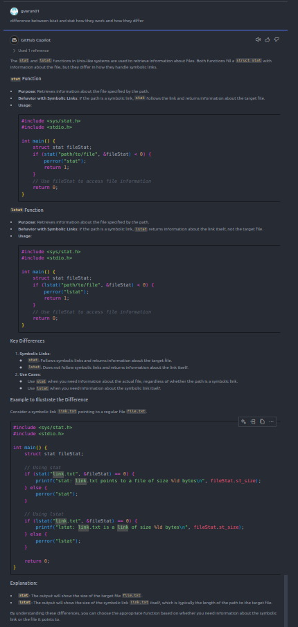

[](https://classroom.github.com/a/Qiz9msrr)
# mini-project-1-template

# Bond Shell
* This is a simple Interactive shell written in C.
* Type 'help' to list all the available commands.
* Type 'exit' to exit the shell.

# Getting Started

1. **Download the Code:** Obtain the source code from the repository by either downloading zip or using git clone
    ```bash
    git clone https://github.com/OSN-Monsoon-2024/mini-project-1-gvarun01.git
    ```

2. **Compile:**  Use a C compiler to compile the code.
    ```bash
    make
    ```

3. **Run:** Execute the compiled binary.
    ```bash
    ./bondshell
    ```


## Description

- main.c: to keep accepting commands and calling the relevant functions
- global.c: to set the global values which will remain constant throughout. ALso include some globally used functions.
- execute.c: to execute any command also for input parsing or formatting
- prompt.c: to set correct prompts (based on the current directory) every time
- proclore.c: for all `proclore` commands
- bg.c: for handling background processes
- syscmd.c: for handling system commands (like `echo`, `sleep` , vim, etc)
- seek.c: for handling `seek` commands
- reveal.c: for handling `reveal` commands
- hop.c: for handling `hop` commands
- log.c: for handling `log` commands
- help.c: for handling `help` command for help page
- activities.c: for handling `activities` command
- parser.c: for handling parsing of `;` and `|`.
- neonate.c: for handling `neonate` command
- IO_redirection.c: for handling `IO Redirection`
- iman.c: for handling `iman` command
- fgbg.c: for handling `fg-bg` commmands
- fg.c: for executing a process in foreground
- config.c: for adding configuration file, `.myshrc` to shell.


## Assumptions
- The maximum size of file name is 256. `MAX_NAME`
- The maximum size of system name is 256. `MAX_NAME`
- The maximum size of user name is 256. `MAX_NAME`
- The maximum size of a path is 4096. `MAX_PATH`
- The maximum size of a command is 4096. `MAX_COMMAND`
- The maximum number of commands in history is 15. `MAX_HISTORY`
- The maximum number of hop argument is 100. `MAX_HOP`
- The maximum number of background processes that can be executed at a time is 1000. `MAX_BG_PROCESSES`.
- The maximum number of pipes that can be executed at a time is 100. `MAX_PIPES`
- All this parameters can be directly changed from `global.h` file.
- Everywhere home is defined as home of shell that is the directory where shell is run. It will never represent the home of system. `~` is refered as home.
- If the shell is not able to get username or cwd or system name it will print the error and exit the shell because basic initialization is not possible.
- In case of mutiple commands using `;` i will be executing commands in sequential order no matter there is a error in one of the commands all commands will try to execute for example:

    ```bash
    varun-gupta@Dell:~> hop ..; hop ~ ; hop test11111 ; hop ..
    /home/varun-gupta/Documents/SEM-3/OSN/projects/MP1
    /home/varun-gupta/Documents/SEM-3/OSN/projects/MP1/my-shell
    Error: chdir failed for test11111
    /home/varun-gupta/Documents/SEM-3/OSN/projects/MP1
    ```
- If I do `cd ..` when I am at `/`, where there isn't any further parent directory to go back to, I will just stay there (similar to the Ubuntu terminal). There will be error printed but no directory changing.
- If relative path is given as argument, it will be given in the format: `~/xyz` or `./xyz` similar to `xyz`.
- Absolute path is given as argument if and only if it begins with `/` 
- No file or directory has space(s) in its name
- For any command executing multiple things (maybe using `;` or `hop`) if we are doing multiple commands like `hop dir1 dir2 dir3` and assume argument dir2 does not worked then i will still execute for dir3.
- For `reveal`
    * The Lexicographically order is same as used in ls command. Suppose i have files as `a.out Dir1 dubdab ASM` the what ls does is `ASM a.out Dir1 dubdab`. I am following simmilar ordering style.
    * you can not type whitespace or tab in between flags it will through error i.e.
        ```bash
        reveal -al-l  // it is allowed but,
        reveal -a -l  // you can not do something like this would not work and give error
        reveal --a    // it wont work
        reveal -hh    // it is also invalid flag
        ```
- For `log`
    * Max history stored is 15 which will overwrite after that.
    * History of command is stored in a file named `history.txt` which is created when you start program and will not delete even after closing terminal.
    * I am storing commands as it is without any formatting i.e.
    `echo "OSN" ;echo "Lite" ` would  be stored as it is and would be different from command `echo "OSN" ; echo "Lite"` and not considered same in log file also.
    * log is persistent across sessions.

- For `Foreground Process`
    * If we run multiple foreground process ( like `sleep 3 ; sleep 2 ; sleep 5` ) using `;` then for printing time in promt what i do is print
    `sleep : [3s] | sleep : [5s]` it skips sleep 2 as its execution time is not strictly greater than 2.

- For `Background Process`
    * I am relying on previous specification which is even harder that on adding a background process I print processs Id , then when background process exits i only prints its exiting after some user command is entered.

- File name inputs are case sensitive

- For `piping`
    * If i am doing cmd1 | cmd2 | .... then output of every cmd will be piped but cmd will execute, that is
        ```bash
        hop .. | wc
        1 3 24
        # wc took the output of hop .. as input
        # simultaneously, hop .. will also execute that is directory will change to its parent directory.
        ``` 
    
    * You can not pipe two processes when one process is in background and the other is in foreground i.e.
        ```bash
        echo osn_lite & | wc (Wrong)
        # this will give a syntax error
        echo osn_not_lite | wc & (Right)
        # this will do piping in background
        ```

    
- You can not use any `signals` while the animation is running.

- I considered a background process to be `Running` when its program state is `R` or `S` or `Z`. It is considered `Stopped` in all other cases.


#
# Use of Copilot:-

 

 
 
 
 

 
 
 
 

 
 


 
 
 
 
 


#
